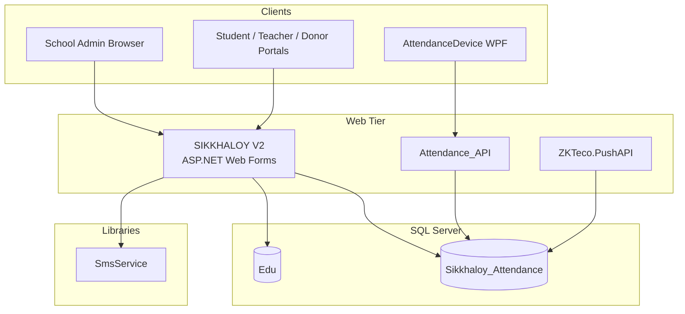

# SIKKHALOY-V3 — Project Overview

School management platform for Bangladeshi institutions. Multi-tenant SaaS with per-school billing, student/teacher portals, exams, accounts, attendance (biometric), and SMS.

**Solution:** `SIKKHALOY.sln` (Visual Studio 2022)  
**Primary app:** `SIKKHALOY V2/` — assembly `EDUCATION.COM`, .NET Framework 4.7.2, ASP.NET Web Forms

---

## Solution Projects

| Project | Path | Role |
|---------|------|------|
| **EDUCATION.COM** | `SIKKHALOY V2/` | Main web application (~250+ pages, ~623 `.cs` files) |
| **Attendance_API** | `Attendance_API/` | REST API for attendance sync (Web API 2 + EF6) |
| **AttendanceDevice** | `AttendanceDevice/` | WPF desktop app for ZKTeco biometric devices |
| **SmsService** | `SmsService/` | SMS provider library (BanglaPhone, GreenWeb) |
| **SmsSenderApp** | `SmsSenderApp/` | Standalone WPF SMS sender |
| **ZKTeco.PushAPI** | `ZKTeco_Manager/ZKTeco.PushAPI/` | Push API for device attendance |
| **ZKdllRegistrationApp** | `ZKdllRegistrationApp/` | ZKTeco SDK DLL registration utility |

`ZKTeco_Manager/` also contains Core, GUI, and Windows Service projects (separate solution `ZKTeco_Manager.sln`).

---

## Architecture



### Web Forms page pattern

Every feature page uses the classic triplet:

- `PageName.aspx` — markup and server controls
- `PageName.aspx.cs` — code-behind (`Page_Load`, event handlers)
- `PageName.aspx.designer.cs` — auto-generated control declarations

```aspx
<%@ Page MasterPageFile="~/BASIC.Master" CodeBehind="Money_Receipt.aspx.cs"
    Inherits="EDUCATION.COM.Accounts.Payment.Money_Receipt" %>
```

### Master pages

| Master | Audience |
|--------|----------|
| `BASIC.Master` | School admins |
| `Basic_Teacher.Master` | Teachers |
| `Basic_Student.Master` | Students |
| `Basic_Donor.Master` | Committee donors |
| `Basic_Authority.Master` | Platform authority users |
| `Design.Master` | Public/marketing pages |

Masters enforce auth and build navigation from `Link_Category`, `Link_Pages`, and `Link_Users` tables.

### Data access

No centralized DAL. Patterns used in parallel:

1. Inline ADO.NET in code-behind (`SqlConnection`, `SqlCommand`, parameters)
2. Declarative `SqlDataSource` in `.aspx` markup
3. Typed DataSets (`.xsd`) with TableAdapters
4. `.ashx` / `.asmx` handlers in `Handeler/` (note spelling)

### Multi-tenancy

Session keys set at login (`Login.aspx.cs`):

- `SchoolID`, `School_Name`, `RegistrationID`, `Edu_Year`
- Role-specific: `TeacherID`, `CommitteeMemberID`
- Authority users: `SchoolID = "Authority"`

Nearly all queries filter by `@SchoolID` and `@EducationYearID`.

### Authentication and roles

- ASP.NET Forms Authentication + `SqlMembershipProvider` + `SqlRoleProvider`
- Roles: `Authority`, `Sub-Authority`, `Admin`, `Sub-Admin`, `Teacher`, `Student`, `Donor`
- Flow: `Default.aspx` → `Login.aspx` → `Profile_Redirect.aspx` → role dashboard

---

## Main Modules (`SIKKHALOY V2/`)

| Module | Path | Purpose |
|--------|------|---------|
| Accounts | `Accounts/` | Fees, payment collection, receipts, expenses, reports |
| Authority | `Authority/` | Super-admin: institutions, invoices, SMS, page links |
| Exam | `Exam/` | Marks, results, admit cards, seat plans |
| Committee | `Committee/` | Donors, dues, online payments |
| Admission | `Admission/` | New admission, promotion, re-admission |
| Employee | `Employee/` | Staff HR, salary, leave |
| Attendances | `Attendances/` | Attendance settings, fines, display |
| Student | `Student/` | Student portal, online payment |
| Teacher | `Teacher/` | Teacher portal |
| Profile | `Profile/` | Admin profile, platform invoices, support |
| SMS | `SMS/` | Templates, recharge, sending |
| Administration | `Administration_Basic_Settings/` | Certificates, class/section setup, users |
| ID Cards | `ID_Cards/` | Student ID generation |
| API | `API/` | `Device_Attendance.asmx` |
| Handlers | `Handeler/` | Image/signature handlers, lookup services |

---

## Technology Stack

| Layer | Technology |
|-------|------------|
| Language | C# |
| Web | ASP.NET Web Forms 4.7.2, Web API 2 (satellite apps) |
| Desktop | WPF |
| Database | SQL Server (`System.Data.SqlClient`) |
| UI | Bootstrap, MDBootstrap, jQuery, Ajax Control Toolkit |
| Reporting | ReportViewer (RDLC), Select.Pdf |
| Payments | ShurjoPay (platform), Amarpay (school fees) |
| SMS | `SmsService` library |
| Build | MSBuild / Visual Studio 2022 |

---

## Databases

| Database | Connection name | Purpose |
|----------|-----------------|---------|
| **Edu** | `EducationConnectionString`, `Login`, `EduConnectionString` | Main school data, membership |
| **Sikkhaloy_Attendance** | `AttendanceConnectionString` | Biometric attendance |

Schema is SQL-first with stored procedures. Migrations live in:

- `Database/` — structured scripts, SPs, jobs
- `Database Scripts/` — monthly billing (`sp_Monthly_Auto_Process`)
- `Database_Scripts/` — feature migrations
- `SIKKHALOY V2/Database/` — app-specific patches

### Key tables

| Table | Purpose |
|-------|---------|
| `SchoolInfo` | Institution profile, payment gateway config |
| `Registration` | User accounts |
| `Education_Year` | Academic sessions |
| `Student`, `StudentsClass` | Student records |
| `Income_PayOrder`, `Income_PaymentRecord` | Fee billing |
| `AAP_Invoice` | Platform service invoices |
| `SMS`, `SikkhaloySetting` | SMS balance and providers |
| `CommitteeMember` | Donor/committee billing |
| `Link_Category`, `Link_Pages`, `Link_Users` | Dynamic navigation |

---

## Payments

| Gateway | Scope | Location |
|---------|-------|----------|
| **ShurjoPay** | Platform invoices, SMS recharge | `Profile/Invoice/`, `SMS_Recharge.aspx`, `ShurjoPayService.cs` |
| **Amarpay** | Per-school student fees | `Student/OnlinePayment/PaymentFactory.cs` |

School-level gateway credentials are stored in `SchoolInfo`.

---

## Naming Conventions

| Element | Convention |
|---------|------------|
| Pages | `PascalCase_With_Underscores.aspx` |
| Namespace | `EDUCATION.COM.{Module}.{SubModule}` |
| Legacy helpers | `Education` namespace (`SMS_Class`, etc.) |
| SQL params | `@SchoolID`, `@RegistrationID`, `@EducationYearID` |
| Validation | String literals `'Valid'` / `'Invalid'` |
| Handlers folder | `Handeler` (intentional spelling in codebase) |
| Controls | ASP.NET style: `NameTextBox`, `CategorySQL` |

UI is bilingual (English + Bengali). UTF-8 is enforced in `Web.config`.

---

## Configuration

| File | Purpose |
|------|---------|
| `SIKKHALOY V2/Web.config` | Connection strings, Forms Auth, ShurjoPay, globalization |
| `SIKKHALOY V2/Global.asax.cs` | Session lifecycle tracking |
| `.editorconfig` | C# formatting (4-space indent, CRLF) |

**Do not commit secrets.** `Web.config` contains live credentials; use environment-specific transforms for deployment.

---

## Existing Documentation

Scattered `.md` files — no central README until this document:

- Root: `DEPLOYMENT_INSTRUCTIONS.md`, `COMMITTEE_BILLING_*.md`, `SMS_BANGLA_*.md`
- `Database Scripts/`: `Setup_Guide.md`, `Quick_Reference.md`
- `ZKTeco_Manager/`: `PROJECT_SUMMARY.md`, `DEPLOYMENT.md`, architecture guides
- `SIKKHALOY V2/Documentation/`: feature-specific guides

---

## Development Notes

1. **Primary work target** is `SIKKHALOY V2/` — Web Forms, not MVC.
2. **Match existing patterns** — page triplet, inline SQL, session-scoped queries.
3. **Minimize scope** — no new repository/DAL layers unless explicitly requested.
4. **SQL migrations** go in `Database_Scripts/` or `SIKKHALOY V2/Database/` with descriptive names.
5. **Only project reference** from main web app: `SmsService`.
6. **Cursor rule** for AI assistance: `.cursor/rules/sikkhaloy.mdc`.
